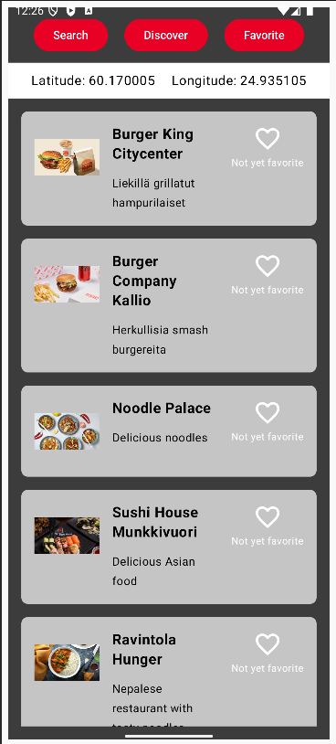
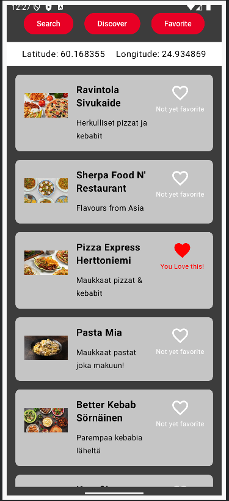
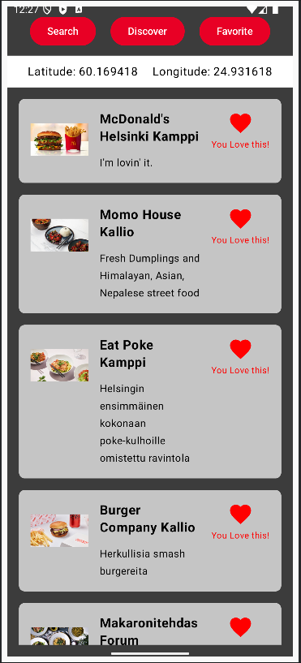

# RestaurantDiscover

## Overview
A mock food app feature involving retrieving API endpoint based on a set of coordinates. The product will cycle through 9 sets of coordinate and displayed up to 15 restaurants based on the location. Each restaurant will have it's name, short description, an image and a favorite button. User will be able to favorite the restaurant they want and the liked restaurant will be saved when the app reopens. On the top there are three tabs, you start with Discover and you can select Favorite and see all the restaurants that you have favorited. 

## Example
<h4>App Feature Discover and Favorite</h4>

<h4>Screenshot Discover 1</h4>

<h4>Screenshot Discover 2 with a favorite restaurant</h4>

<h4>Screenshot Discover 3 Favorite Tab</h4>

## Features
- Retrieving API endpoints with coordiantes
- Clean Architecture for scalablity
- Saving the state of Liked for each restaurant, pairing with its restaurant ID

## Possible Updates
Things that I am looking to update this project with is the Search Tab and using my current location. 

## Note:
This project is an application task, so no codes are provided. 
